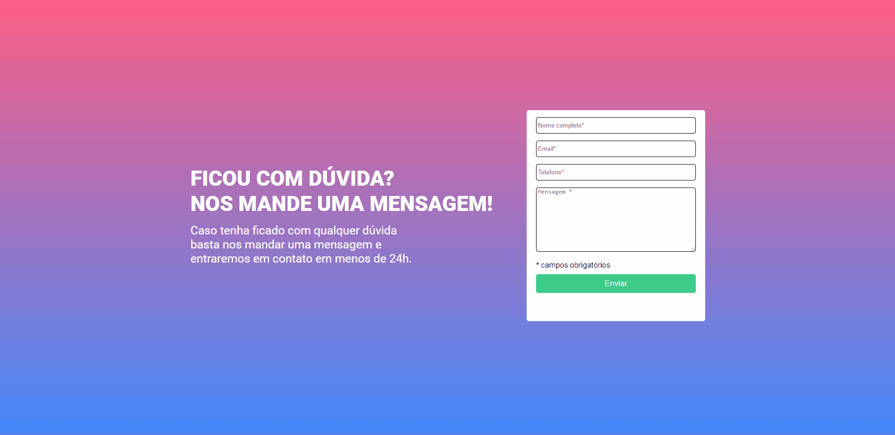

# PROJETO FORMULÁRIO COM JAVASCRIPT

Desafio feito para o curso de front-end DevQuest, modulo de JavaScript Intermediario.

## PROPOSTA DO DESAFIO 🚀

- A validação do formulário deve ser feita com javascript puro.

- Ao clicar para enviar o formulário, se caso algum campo não estiver preenchido, a borda do input deve ficar vermelha e uma mensagem de "campo obrigatório" deve aparecer embaixo do campo que não foi preenchido, conforme o figma.
- quando um campo for preenchido, na mesma hora a borda do input deve ficar verde e o texto "campo obrigatório" deve sumir. o fundo do formulário deve ser feito usando a imagem em anexo na hotmart e usando o background-repeat: repeat.

## PROJETO FEITO ABAIXO 

## TECNOLOGIAS UTILIZADAS 

  
  
  

  ## APRENDIZADOS 
   
   Mais uma vez pude fazer algo sozinho completamente do 0 com esse desafio e consegui fixar mais ainda o método de adicionar e tirar classes tudo pelo javascript acredito que a cada dia evoluo mais.

  
  ## LINK HOSPEDADO NO GITHUB PAGES 